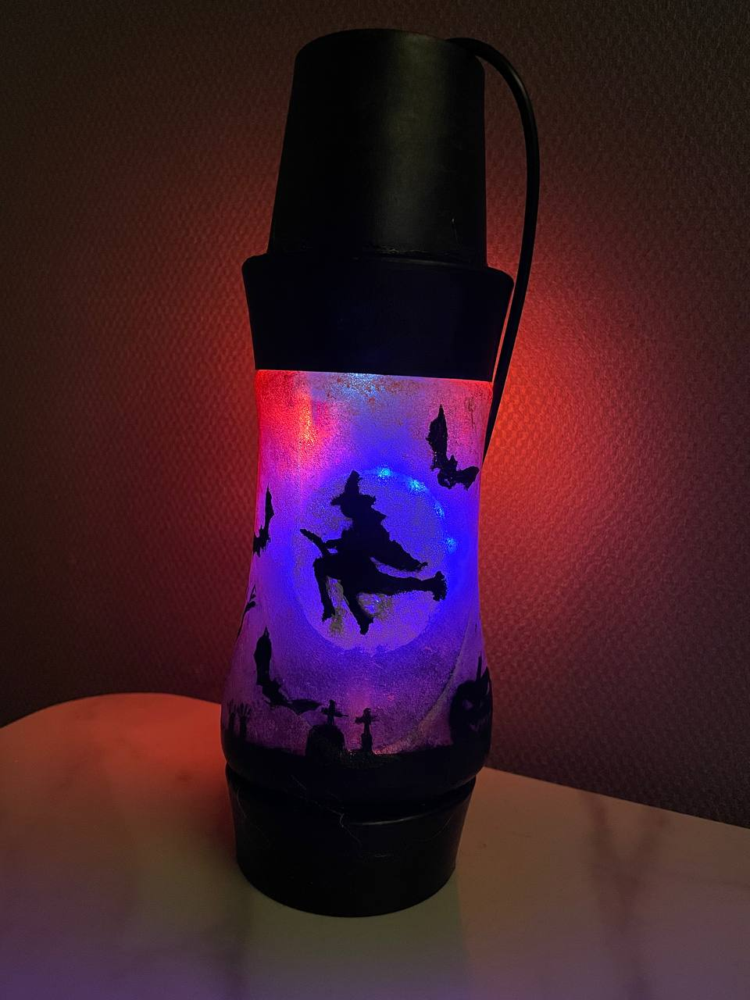
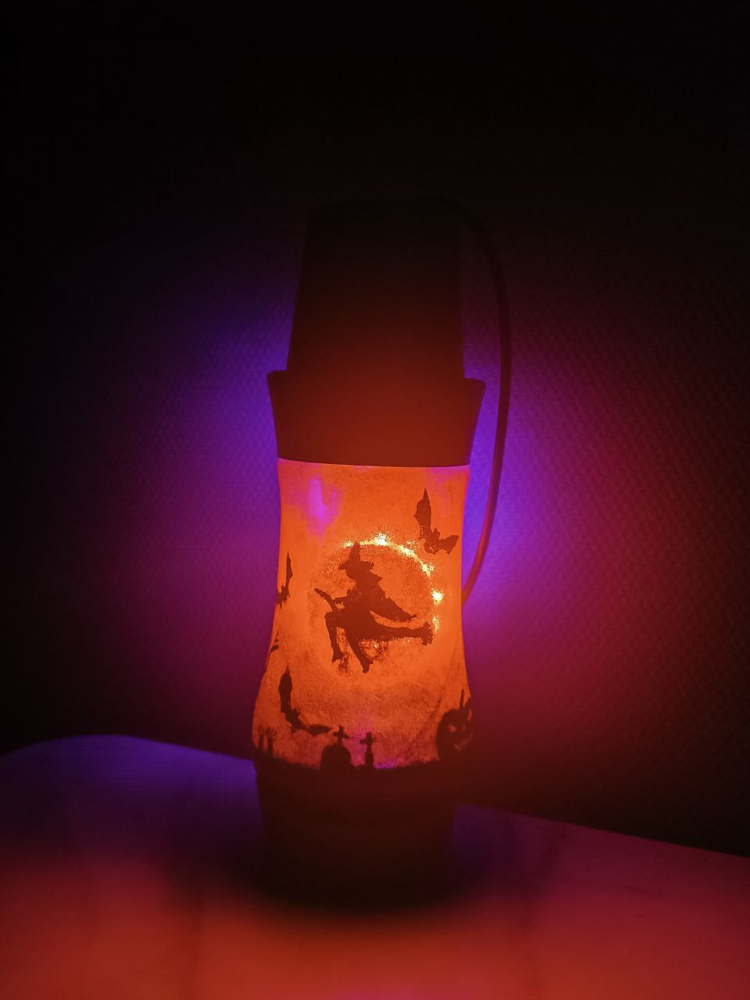
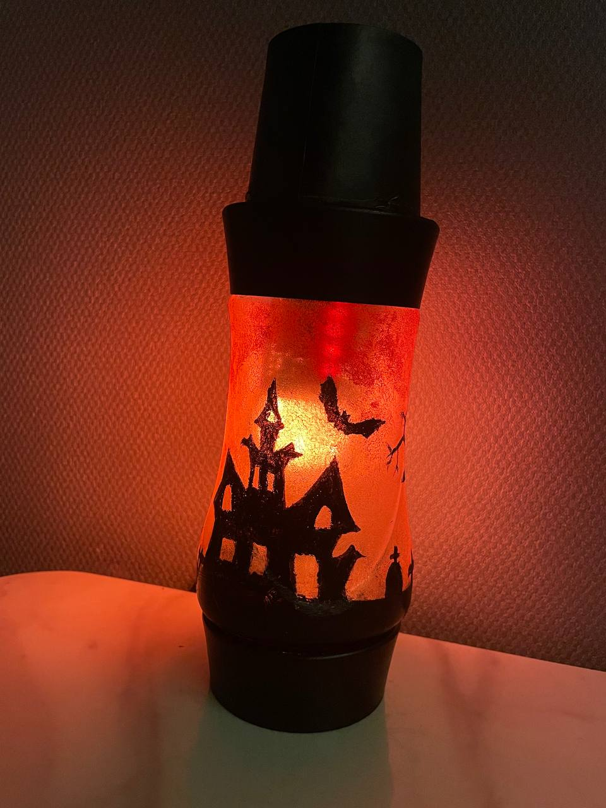

| Supported Targets | ESP32-C3 |
| ----------------- |----------|

# Magic Lamp
## Schema


## Demo

---

---


## MQTT Control Messages

Topic: /darvik-home/magic-lamp/action
* Front 
```json
{
  "action-id": 0, 
  "color": "8b1000"
}
```

* Back
```json
{
  "action-id": 9, 
  "color": "01000"
}
```

## MQTT Telemetry
Topic: /darvik-home/magic-lamp/telemetry
```json
{
  "free-heap": 194888,
  "stack-watermark": 1908,
  "temperature": 40.79999923706055
}
```

## Stub

Front:
{"action-id": 0, "color": "8b1000"}
{"action-id": 0, "color": "101010"}
{"action-id": 0, "color": "000002"}

Back:
{"action-id": 9, "color": "010000"}